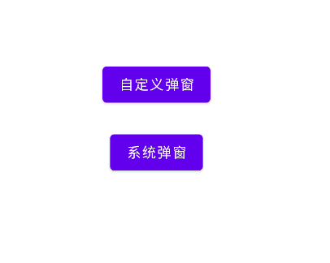
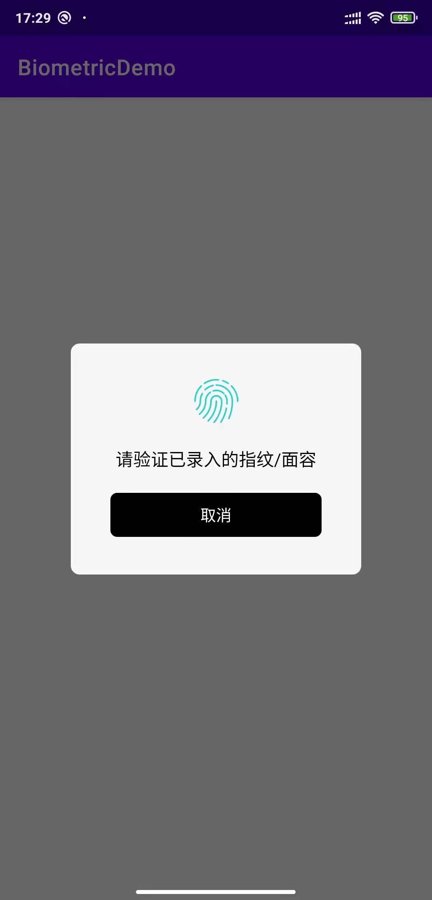
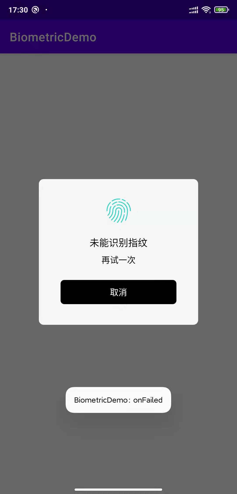
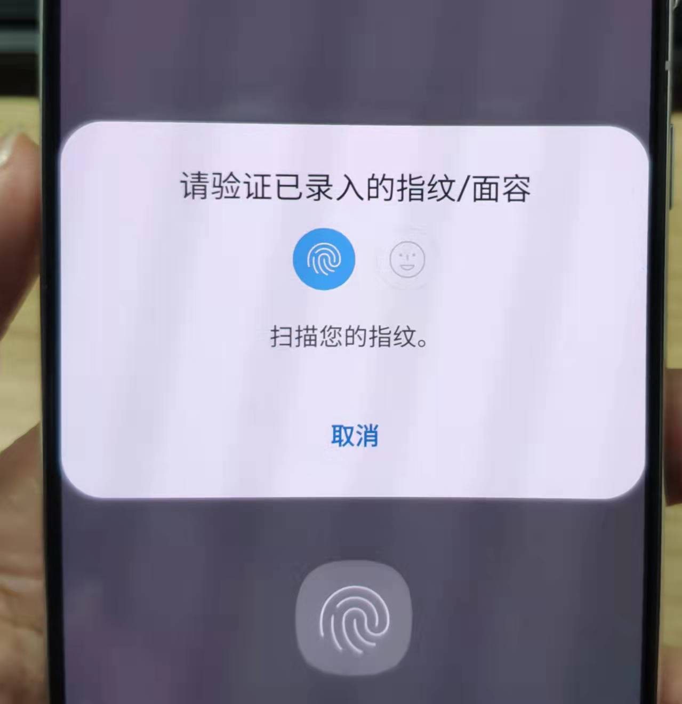
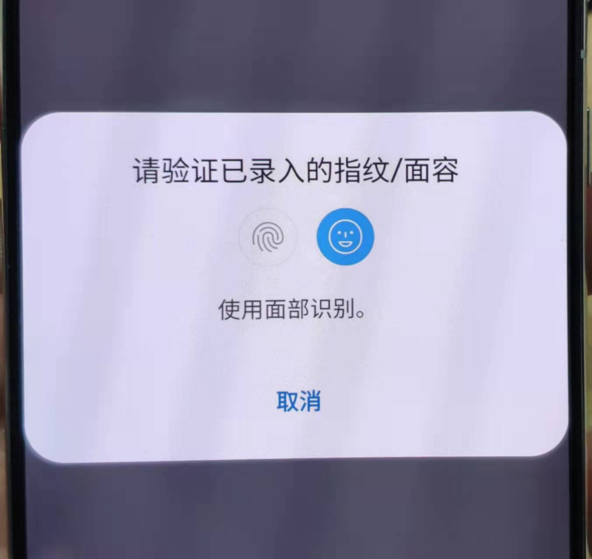
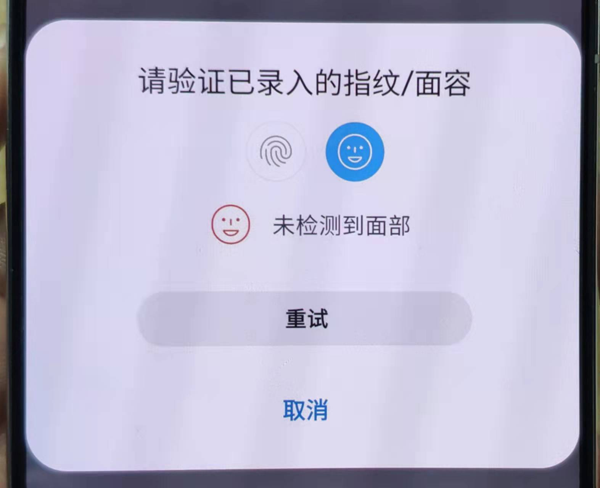
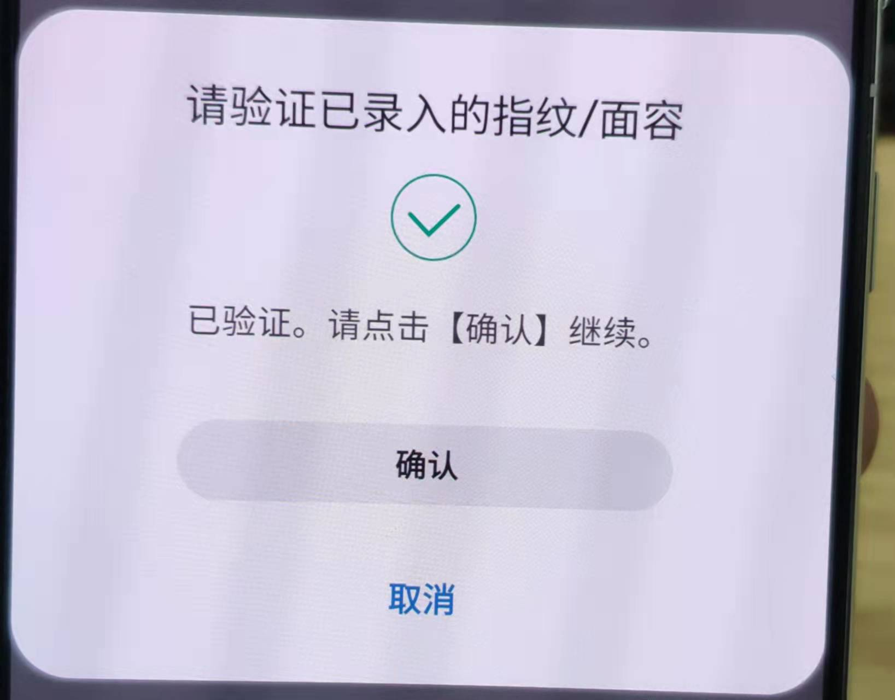
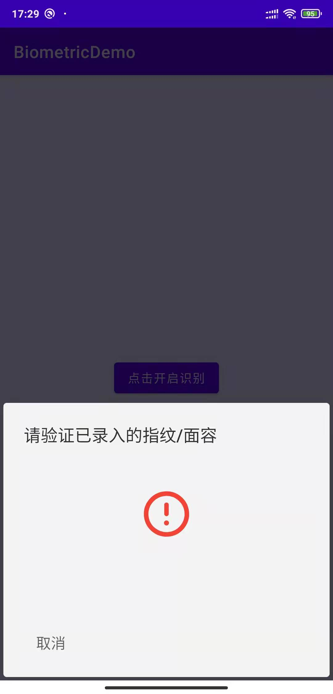

# BiometricHelper-指纹识别，面部识别，自定义弹窗，用法超级简单   
## [github地址](https://github.com/ITxiaoguang/BiometricHelper)

# 基于安卓原生指纹识别和面部识别的工具类，可按需求自定义弹窗


## 项目演示


## 截图:









## 特点功能:

- 支持系统弹窗
- 支持采用SDK弹窗
- 支持采用自定义弹窗

</br>

| 小于Android 6 Api 小于 23 |
| --- | 
| 不支持|

</br>

|  Android 6到8 Api 23到27 | 支持SDK弹窗/自定义弹窗 | 支持系统弹窗 | 支持面部识别 |
| --- | --- | -- | -- |
| 不开启enableAndroidP | true  | false  | false | 
| 开启enableAndroidP  |true | false  | false |

</br>

|  Android 9 Api 28 | 支持SDK弹窗/自定义弹窗 | 支持系统弹窗 | 支持面部识别 |
| --- | --- | -- | -- |
| 不开启enableAndroidP | true  | false  | false | 
| 开启enableAndroidP  |false | true  | false |

</br>

| 大于等于 Android 10 | 支持SDK弹窗/自定义弹窗 | 支持系统弹窗 | 支持面部识别 |
| --- | --- | -- | -- |
| 不开启enableAndroidP | true  | false  | false |
| 开启enableAndroidP  |false | true  | true |

### FAQ
- 为什么接入SDK没有出现面部识别弹窗？
    - 很多手机没有面部解锁功能
    - 没有开启面部解锁功能
    - 有面部解锁且开启面部解锁也不一定有识别弹窗出现
    - 目前知道三星S21是可以面部识别，你有更多机型可以的调起面部识别弹窗的话可以留言
- 为什么接入SDK没出现指纹识别？
    - 手机不支持指纹解锁或没开启指纹解锁功能

## 如何添加
### Gradle添加：
#### 1.在Project的`build.gradle`中添加仓库地址

``` gradle
allprojects {
  repositories {
     ...
     maven { url "https://jitpack.io" }
  }
}
```

#### 2.在Module目录下的`build.gradle`中添加依赖


``` gradle
dependencies {
    implementation 'com.github.ITxiaoguang:BiometricHelper:xxx'
}
```

## 使用方法:
###  需要指纹权限
```xml
<uses-permission android:name="android.permission.USE_FINGERPRINT" />
```

###  主要调用代码

``` kotlin
private fun showDialog(enableAndroidP: Boolean) {
    BiometricPromptManager.Builder(this)
    // 启动安卓自带弹窗 default true，设置成false面部识别不生效
            .enableAndroidP(enableAndroidP)
            .setCallback(fingerprintCallback)
            .title("请验证已录入的指纹/面容")
            .cancelText("取消")
    // 以下设置 enableAndroidP false 安卓8以上手机才有效
            .setImgRes(R.drawable.ic_fingerprint)
            .failTitle("未能识别指纹")
            .failContent("再试一次")
    // 自定义弹窗(采用工厂模式，继承IBiometricDialog)
    //.setCustomDialog(BiometricDialogCustomImpl())
            .build()
}

private val fingerprintCallback: FingerprintCallback = object : FingerprintCallback {

    @RequiresApi(api = Build.VERSION_CODES.M)
    override fun onSucceeded23(result: FingerprintManagerCompat.AuthenticationResult?) {
        Toast.makeText(this@MainActivity, "success", Toast.LENGTH_SHORT).show()
    }

    @RequiresApi(api = Build.VERSION_CODES.P)
    override fun onSucceeded28(result: androidx.biometric.BiometricPrompt.AuthenticationResult?) {
        Toast.makeText(this@MainActivity, "success", Toast.LENGTH_SHORT).show()
    }

    override fun onFailed() {
        Toast.makeText(this@MainActivity, "onFailed", Toast.LENGTH_SHORT).show()
    }

    override fun onError(errString: CharSequence?) {
        Toast.makeText(this@MainActivity, "onError " + errString, Toast.LENGTH_SHORT).show()
    }

    override fun onCancel() {
        Toast.makeText(this@MainActivity, "onCancel", Toast.LENGTH_SHORT).show()
    }

}


/**
 * onPause生命周期关闭自定义弹窗
 */
override fun onPause() {
    super.onPause()
    if (null != manager) {
        manager!!.onActivityPause()
    }
}

/**
 * onDestroy生命周期关闭自定义弹窗
 */
override fun onDestroy() {
    super.onDestroy()
    if (null != manager) {
        manager!!.onActivityDestroy()
    }
}
```
